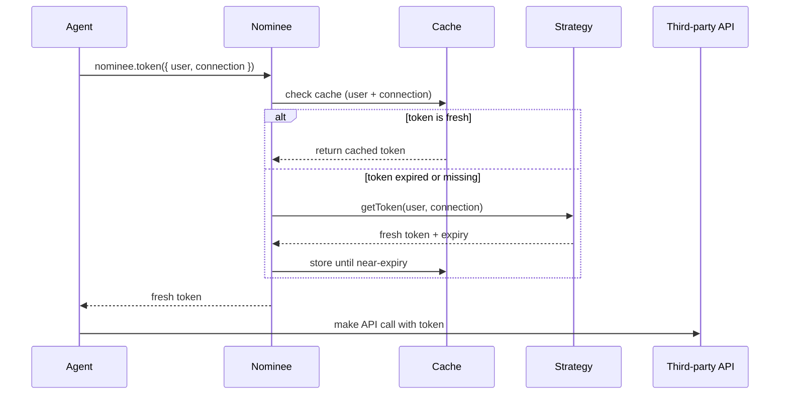
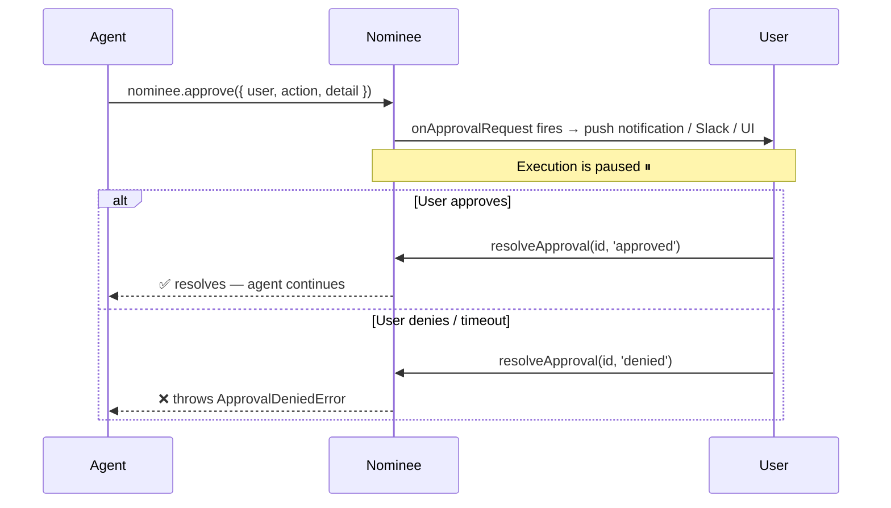

<p align="center">
  
</p>

<p align="center">
  <a href="https://www.npmjs.com/package/nominee"></a>
  <a href="https://www.npmjs.com/package/nominee-ai"></a>
  <a href="https://www.npmjs.com/package/nominee-eve"></a>
  <a href="https://www.npmjs.com/package/nominee-auth0"></a>
  <a href="LICENSE"></a>
</p>

<p align="center">
  <strong>Identity and token delegation for AI agents.</strong><br />
  The provider-neutral auth layer for agents that act on your behalf.
</p>

<p align="center">
  <a href="https://nominee.dev">Website</a> ·
  <a href="https://nominee.dev/docs/">Docs</a> ·
  <a href="https://www.npmjs.com/package/nominee">npm</a> ·
  <a href="SECURITY.md">Security</a>
</p>

<p align="center">
  
</p>

<p align="center">
  <em>▶ <a href="https://nominee.dev">Watch the live demo at nominee.dev</a></em>
</p>

---

## The Problem

You authorized the agent at **9am**. By **3pm**, the GitHub token has expired — but the agent is still running in a Durable Object, pausing for human input, or looping over a massive codebase.

```
❌ 401 Unauthorized — silent failures in long-running agents
```

An agent acting on behalf of a user needs a **fresh** third-party token at the exact moment of a tool call. Sometimes that action is sensitive and needs human approval. It always needs an audit trail.

**nominee** is the provider-neutral layer that solves this — the *"Passport.js of agent auth."*

---

## How It Works



---

## Installation

```bash
npm i nominee
```

No signup. No SaaS account. No vendor lock-in.

---

## Quickstart

```ts
import { Nominee, tokens } from 'nominee'

const nominee = new Nominee({
  // Provide a function that fetches tokens — from your DB, env vars, anywhere
  strategy: tokens(async ({ user, connection }) =>
    db.getFreshToken(user, connection)
  ),

  // Optional: audit every token fetch and approval
  onAudit: (e) => console.log(`[${e.type}] agent=${e.agent} user=${e.user}`),

  agent: 'triage-bot',
})

// Always call at request time — nominee handles caching & refresh automatically
const token = await nominee.token({ user: 'alice', connection: 'github' })
```

> **Design rule:** never cache the token yourself. Call `nominee.token()` at call time, every time. nominee handles freshness transparently.

---

## Human-in-the-Loop Approvals

Gate any agent action behind a real-time human approval — independent of the LLM or framework.



```ts
// Gate an action — blocks until user responds
await nominee.approve({
  user: 'alice',
  action: 'repo.delete',
  detail: 'Delete repo: alice/old-project',
})

// From your webhook (Slack button, push notification, UI)
nominee.resolveApproval(approvalId, 'approved') // or 'denied'
```

---

## Framework Adapters

Nominee plugs directly into your AI framework's tool system.

| Adapter | Package | Links |
|---|---|---|
| **Vercel AI SDK** | `nominee-ai` | [](https://www.npmjs.com/package/nominee-ai) |
| **Vercel Eve** | `nominee-eve` | [](https://www.npmjs.com/package/nominee-eve) |
| **Cloudflare Agents** | `nominee-ai` | Uses the AI SDK adapter |
| **Standalone Node** | `nominee` | Built-in |

---

## Strategies

| Strategy | Use case |
|---|---|
| `tokens(fn)` | Simple function — env vars, your DB, a literal string |
| `OAuth2({ connections })` | Generic OAuth2 refresh-token flow, zero deps |
| `Memory({ tokens })` | Dev & test in-memory store |
| [`nominee-auth0`](https://www.npmjs.com/package/nominee-auth0) | Auth0 Token Vault + CIBA push approvals *(optional)* |

---

## Auth0 — Optional Managed Upgrade

Don't want to manage refresh tokens yourself? `nominee-auth0` uses Auth0's Token Vault and CIBA (Client-Initiated Backchannel Authentication) to handle everything automatically.

```bash
npm i nominee nominee-auth0
```

```ts
import { Nominee } from 'nominee'
import { Auth0 } from 'nominee-auth0'

const nominee = new Nominee({
  strategy: Auth0({
    domain: 'your-tenant.us.auth0.com',
    clientId: process.env.AUTH0_CLIENT_ID,
    clientSecret: process.env.AUTH0_CLIENT_SECRET,
    subjectToken: ({ user }) => sessionStore.getRefreshToken(user),
    ciba: { bindingMessage: (req) => `Approve: ${req.action}` },
  }),
})
```

> Auth0 is entirely optional. The core has zero dependencies and zero lock-in.

---

## Full API

```ts
// Fetch a fresh token (cached, auto-refreshed)
await nominee.token({ user, connection })

// Gate on human approval — throws ApprovalDeniedError if denied/expired
await nominee.approve({ user, action, detail })

// Settle an approval from your webhook
nominee.resolveApproval(id, 'approved' | 'denied')

// Fine-grained authorization (throws unless strategy implements it)
await nominee.can({ user, action, resource })

// Subscribe to all audit events
const unsub = nominee.on((event) => console.log(event))
```

---

## Why nominee

The hard part of agent auth isn't the OAuth dance — it's keeping a token *fresh across a long run*, gating the risky calls, and proving who authorized what. nominee does all three, in one provider-neutral layer.

| Capability | nominee | DIY token refresh | Vercel Connect | AI SDK approvals |
| --- | :---: | :---: | :---: | :---: |
| Fresh token at call time | ✅ built in | you build it | Vercel only | — |
| Provider-neutral | ✅ any provider | yours | Vercel | n/a |
| Human-in-the-loop approval | ✅ built in | — | — | ✅ |
| Audit chain (user→agent→tool) | ✅ built in | — | partial | — |
| No signup · zero-dep core | ✅ | ✅ | — | ✅ |

---

## "Doesn't the AI SDK already have approvals?"

Yes — AI SDK v6 added tool approvals. Nominee adds three things it doesn't cover:

1. **Token lifecycle** — tool calls happen hours after authorization. Nominee manages refresh so you never pass a stale token.
2. **Provider-neutral** — works with Cloudflare Agents, Eve, standalone loops — not just the AI SDK.
3. **Unified audit trail** — one stream across all agents, all frameworks.

---

## Contributing

PRs for community strategies (Clerk, Supabase, WorkOS, etc.) are enthusiastically welcome. See [CONTRIBUTING.md](CONTRIBUTING.md) to learn how to build a strategy. By participating you agree to the [Code of Conduct](CODE_OF_CONDUCT.md).

Found a security issue? Please report it privately — see [SECURITY.md](SECURITY.md).

---

<p align="center">
  Built by <a href="https://github.com/bharath31">Bharath</a> · MIT License · Neutral by design
</p>
