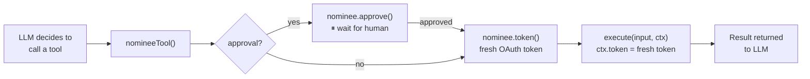

<p align="center">
  
</p>

<p align="center">
  <a href="https://www.npmjs.com/package/nominee-ai"></a>
  <a href="https://www.npmjs.com/package/nominee"></a>
  <a href="https://github.com/bharath31/nominee/blob/main/LICENSE"></a>
</p>

<p align="center">
  <strong>Vercel AI SDK adapter for nominee.</strong><br />
  Fresh tokens and human-in-the-loop approval — injected automatically into every tool call.
</p>

---

## Installation

```bash
npm i nominee nominee-ai
```

Also works with **Cloudflare Agents** — they use the same AI SDK internals.

---

## How It Works



---

## Quickstart

```ts
import { Nominee, tokens } from 'nominee'
import { nomineeTool } from 'nominee-ai'
import { generateText } from 'ai'
import { openai } from '@ai-sdk/openai'
import { z } from 'zod'

const nominee = new Nominee({
  strategy: tokens(({ connection }) =>
    process.env[`${connection.toUpperCase()}_TOKEN`]!
  ),
})

const starRepo = nomineeTool({
  nominee,
  user: 'user_123',
  connection: 'github',                       // fresh token injected into ctx.token
  description: 'Star a GitHub repository',
  inputSchema: z.object({ repo: z.string() }),
  execute: async ({ repo }, ctx) => {
    await fetch(`https://api.github.com/user/starred/${repo}`, {
      method: 'PUT',
      headers: { Authorization: `Bearer ${ctx.token}` },
    })
    return `Starred ${repo}`
  },
})

const { text } = await generateText({
  model: openai('gpt-4o'),
  tools: { starRepo },
  prompt: 'Star the vercel/ai repo for me',
})
```

---

## Human Approval

Gate any tool behind a real-time approval before it runs:

```ts
const deleteRepo = nomineeTool({
  nominee,
  user: 'user_123',
  connection: 'github',
  approval: true,               // ⏸ pauses until user approves
  action: 'repo.delete',
  description: 'Delete a GitHub repository',
  inputSchema: z.object({ repo: z.string() }),
  execute: async ({ repo }, ctx) => {
    // Only runs after explicit human approval
    await fetch(`https://api.github.com/repos/${repo}`, {
      method: 'DELETE',
      headers: { Authorization: `Bearer ${ctx.token}` },
    })
    return `Deleted ${repo}`
  },
})
```

---

## `withNominee` — Set Defaults Once

Apply a shared `nominee` instance and user context across all tools in one call:

```ts
import { withNominee } from 'nominee-ai'

const nomineeTool = withNominee(nominee, {
  user: 'user_123',      // can also be an async resolver: async (ctx) => ctx.userId
})

// All tools share the same user by default
const starRepo = nomineeTool({
  connection: 'github',
  description: 'Star a repository',
  inputSchema: z.object({ repo: z.string() }),
  execute: async ({ repo }, ctx) => starRepoForUser(repo, ctx.token),
})
```

---

## Tool Context

The `execute` function receives a rich context object:

```ts
execute: async (input, ctx) => {
  ctx.token     // string — fresh OAuth token for the configured connection
  ctx.user      // string — the current user ID
  ctx.ai        // the raw AI SDK tool context (messages, toolCallId, etc.)
}
```

---

## TypeScript

Full generics are preserved end-to-end:

```ts
const tool = nomineeTool({
  inputSchema: z.object({ repo: z.string() }), // input is typed as { repo: string }
  execute: async ({ repo }, ctx) => {           // return type is inferred
    return { starred: repo, at: new Date() }
  },
})
```

---

<p align="center">
  <a href="https://github.com/bharath31/nominee">GitHub</a> ·
  <a href="https://www.npmjs.com/package/nominee">nominee core</a> ·
  MIT License
</p>
