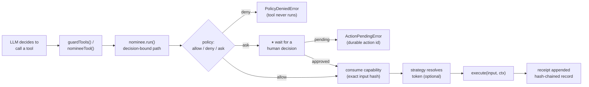

<p align="center">
  
</p>

<p align="center">
  <a href="https://www.npmjs.com/package/nominee-ai"></a>
  <a href="https://www.npmjs.com/package/nominee"></a>
  <a href="https://github.com/bharath31/nominee/blob/main/LICENSE"></a>
</p>

<p align="center">
  <strong>Vercel AI SDK adapter for nominee.</strong><br />
  Policy, approvals, and receipts on every AI SDK tool call — one line to wrap your whole tools object.
</p>

---

## Installation

```bash
npm i nominee nominee-ai
```

Also works with **Cloudflare Agents** — they use the same AI SDK internals.

---

## Observe Before Enforcing

Pass `new Nominee({ mode: 'observe' })` to `guardTools`, `nomineeTool`, or
`withNominee` to inventory the tool callbacks that actually run before writing
a policy. The adapter still routes through `run()`, but denies, asks, budgets,
and `approval: true` are recorded rather than enforced. Observation reports do
not retain raw string/boolean values or user IDs; numeric aggregates may be
sensitive. Observe mode is not a security control and cannot be combined with
`production: true`.

---

## How It Works


```mermaid
flowchart LR
    LLM["LLM decides to\ncall a tool"] --> G["guardTools() /\nnomineeTool()"]
    G --> RUN["nominee.run()\ndecision-bound path"]
    RUN --> P{"policy:\nallow / deny / ask"}
    P -->|deny| X["PolicyDeniedError\n(tool never runs)"]
    P -->|ask| AP["⏸ wait for a\nhuman decision"]
    AP -->|pending| APE["ActionPendingError\n(durable action id)"]
    AP -->|approved| CAP["consume capability\n(exact input hash)"]
    P -->|allow| CAP
    CAP --> TOK["strategy resolves\ntoken (optional)"]
    TOK --> EX["execute(input, ctx)"]
    EX --> R["receipt appended\nhash-chained record"]
```

Every call routes through `nominee.run()` — the decision-bound path that binds authorization to a fingerprint of the arguments and issues a single-use capability before `execute` runs. Denied calls throw `PolicyDeniedError`; `ask` calls block until a human decides or surface `ActionPendingError` with a durable action id when the approval outlives the request; every outcome (including refusals) lands on the receipt chain.

---

## Quickstart — `guardTools`

Wrap your existing AI SDK tools object in one line. The object key is the tool name your policy matches on:

```ts
import { Nominee, allow, deny, ask } from 'nominee'
import { guardTools } from 'nominee-ai'
import { generateText } from 'ai'
import { openai } from '@ai-sdk/openai'

const nominee = new Nominee({
  policy: {
    rules: [
      allow('searchEmail'),
      deny('forwardEmail', { reason: 'external forwarding is exfiltration' }),
      ask('mergePr'), // a human decides, every time
    ],
    fallback: 'deny',
  },
  onApprovalRequest: (req) => notifySlack(req), // req.approve() / req.deny()
})

const { text } = await generateText({
  model: openai('gpt-4o'),
  tools: guardTools(nominee, { searchEmail, forwardEmail, mergePr }, { user: 'alice' }),
  prompt: 'Triage my inbox',
})
```

Your tools are unchanged — `guardTools` intercepts each `execute`, calls `nominee.run({ tool, input, user })`, and only then runs the original. Client-executed tools (no `execute`) pass through untouched. `user` can also be an async resolver of the tool-call options: `(options) => session.userId`.

---

## `nomineeTool` — Per-Tool Config

When a tool also needs a fresh third-party token, a forced approval, or its own policy action name, build it with `nomineeTool`:

```ts
import { nomineeTool } from 'nominee-ai'
import { z } from 'zod'

const starRepo = nomineeTool({
  nominee,
  user: 'user_123',
  connection: 'github',       // fresh token injected into ctx.token at call time
  action: 'github.star',      // the tool name your policy rules match on
  description: 'Star a GitHub repository',
  inputSchema: z.object({ repo: z.string() }),
  execute: async ({ repo }, ctx) => {
    await fetch(`https://api.github.com/user/starred/${repo}`, {
      method: 'PUT',
      headers: { Authorization: `Bearer ${ctx.token}` },
    })
    return `Starred ${repo}`
  },
})
```

The policy is enforced here too — `nomineeTool` routes through `nominee.run()` on `action` (default `"tool"`) before `execute` runs, then resolves the token via your nominee strategy inside the capability callback (fresh at call time, single-flight refresh). Pass `resource`, `tenant`, and `scopes` when your policy or strategy needs them.

---

## Forcing an Approval

`approval: true` forces an `ask` even when the policy allows the call — the tool pauses until a human decides, and a denial throws `ApprovalDeniedError` before `execute`:

```ts
const deleteRepo = nomineeTool({
  nominee,
  user: 'user_123',
  connection: 'github',
  approval: true,               // ⏸ pauses until a human approves
  action: 'repo.delete',
  description: 'Delete a GitHub repository',
  inputSchema: z.object({ repo: z.string() }),
  execute: async ({ repo }, ctx) => {
    // Only runs after explicit human approval
    await fetch(`https://api.github.com/repos/${repo}`, {
      method: 'DELETE',
      headers: { Authorization: `Bearer ${ctx.token}` },
    })
    return `Deleted ${repo}`
  },
})
```

For rule-driven escalation (`ask('repo.delete')`, argument-level `when` conditions, `max` budgets), put it in the policy instead — the decision and its resolution are sealed into the receipt chain either way.

---

## `withNominee` — Set Defaults Once

Apply a shared `nominee` instance and user context across all tools in one call:

```ts
import { withNominee } from 'nominee-ai'

const nomineeTool = withNominee(nominee, {
  user: 'user_123',      // or an async resolver of the tool-call options
})

// All tools share the same user by default
const starRepo = nomineeTool({
  connection: 'github',
  description: 'Star a repository',
  inputSchema: z.object({ repo: z.string() }),
  execute: async ({ repo }, ctx) => starRepoForUser(repo, ctx.token),
})
```

---

## Tool Context

The `execute` function of a `nomineeTool` receives a rich context object:

```ts
execute: async (input, ctx) => {
  ctx.token     // string — fresh token for the configured connection (if any)
  ctx.user      // string — the resolved principal
  ctx.ai        // the raw AI SDK tool context (messages, toolCallId, etc.)
}
```

---

## TypeScript

Full generics are preserved end-to-end:

```ts
const tool = nomineeTool({
  inputSchema: z.object({ repo: z.string() }), // input is typed as { repo: string }
  execute: async ({ repo }, ctx) => {           // return type is inferred
    return { starred: repo, at: new Date() }
  },
})
```

`guardTools` preserves the type of the tools object you pass in.

---

<p align="center">
  <a href="https://github.com/bharath31/nominee">GitHub</a> ·
  <a href="https://www.npmjs.com/package/nominee">nominee core</a> ·
  MIT License
</p>
