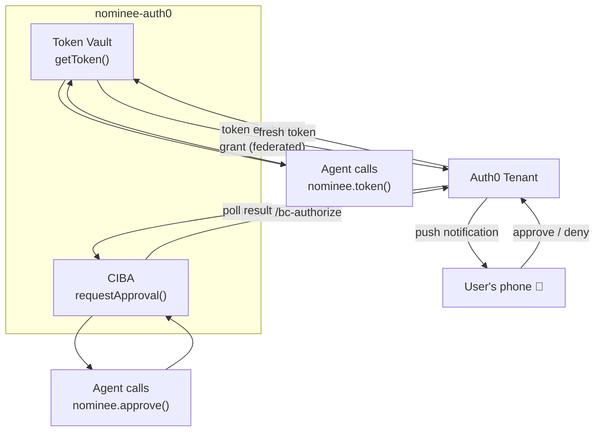

<p align="center">
  
</p>

<p align="center">
  <a href="https://www.npmjs.com/package/nominee-auth0"></a>
  <a href="https://www.npmjs.com/package/nominee"></a>
  <a href="https://github.com/bharath31/nominee/blob/main/LICENSE"></a>
</p>

<p align="center">
  <strong>Auth0 strategy for nominee.</strong><br />
  Token Vault for federated tokens · CIBA for push-to-phone approvals.
</p>

> **Optional.** The nominee core has zero dependencies and works without Auth0. Use this if you want Auth0 to manage token storage and push approvals for you.

---

## Installation

```bash
npm i nominee nominee-auth0
```

---

## What It Does



| Feature | What it does |
|---|---|
| **Token Vault** | Fetches fresh federated connection tokens (GitHub, Google, Slack…) from Auth0. No token storage in your DB. |
| **CIBA** | Pushes an approval request to the user's device and polls until resolved. Real phone notifications, not a polling UI. |

---

## Quickstart

```ts
import { Nominee } from 'nominee'
import { Auth0 } from 'nominee-auth0'

const nominee = new Nominee({
  strategy: Auth0({
    domain: process.env.AUTH0_DOMAIN!,          // e.g. 'my-tenant.us.auth0.com'
    clientId: process.env.AUTH0_CLIENT_ID!,
    clientSecret: process.env.AUTH0_CLIENT_SECRET!,
    subjectToken: ({ user }) => sessionStore.getRefreshToken(user),
  }),
})

// Fetches a fresh GitHub token from Auth0 Token Vault
const token = await nominee.token({
  user: 'auth0|user_123',
  connection: 'github',
})
```

---

## CIBA — Push Approvals

Require human approval before an agent action, delivered as a push notification to the user's phone:

```ts
const nominee = new Nominee({
  strategy: Auth0({
    domain: process.env.AUTH0_DOMAIN!,
    clientId: process.env.AUTH0_CLIENT_ID!,
    clientSecret: process.env.AUTH0_CLIENT_SECRET!,
    subjectToken: ({ user }) => sessionStore.getRefreshToken(user),

    // Enable CIBA
    ciba: {
      bindingMessage: (req) => `Approve "${req.action}"?`,
    },
  }),
})

// Blocks until the user approves on their phone
await nominee.approve({
  user: 'auth0|user_123',
  action: 'repo.delete',
  detail: 'Delete repository: alice/old-project',
})
```

---

## With Adapters

Drop-in replacement — just swap the strategy:

```ts
import { nomineeTool } from 'nominee-ai'   // or nominee-eve
import { z } from 'zod'

const starRepo = nomineeTool({
  nominee,                // Auth0 strategy under the hood
  user: 'auth0|user_123',
  connection: 'github',
  approval: true,
  action: 'repo.star',
  description: 'Star a GitHub repository',
  inputSchema: z.object({ repo: z.string() }),
  execute: async ({ repo }, ctx) => {
    // ctx.token is a fresh token from Auth0 Token Vault
    await fetch(`https://api.github.com/user/starred/${repo}`, {
      method: 'PUT',
      headers: { Authorization: `Bearer ${ctx.token}` },
    })
    return `Starred ${repo}`
  },
})
```

---

## Auth0 Setup

1. Enable **Token Vault** in your Auth0 tenant *(Actions → Token Vault)*.
2. Add your social connections (GitHub, Google, Slack, etc.) as federated connections.
3. Enable **CIBA** in your Auth0 tenant for push-to-phone approvals.

See the [Auth0 documentation](https://auth0.com/docs) for tenant configuration.

---

## Auth0 Strategy Options

```ts
Auth0({
  domain: string           // Auth0 tenant domain
  clientId: string         // M2M application client ID
  clientSecret: string     // M2M application client secret
  subjectToken: (params: GetTokenParams) => string | Promise<string>
  subjectTokenType?: 'refresh_token' | 'access_token'
  fetch?: typeof fetch     // optional custom fetch (defaults to global)

  ciba?: {
    loginHint?: (user: string) => string | Promise<string>
    bindingMessage?: (req: ApprovalRequest) => string  // message shown to user
    pollIntervalMs?: number    // default: from Auth0 response interval
    scope?: string             // default: 'openid'
    audience?: string
  }
})
```

---

<p align="center">
  <a href="https://github.com/bharath31/nominee">GitHub</a> ·
  <a href="https://www.npmjs.com/package/nominee">nominee core</a> ·
  MIT License
</p>
