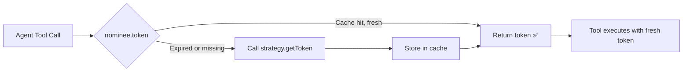
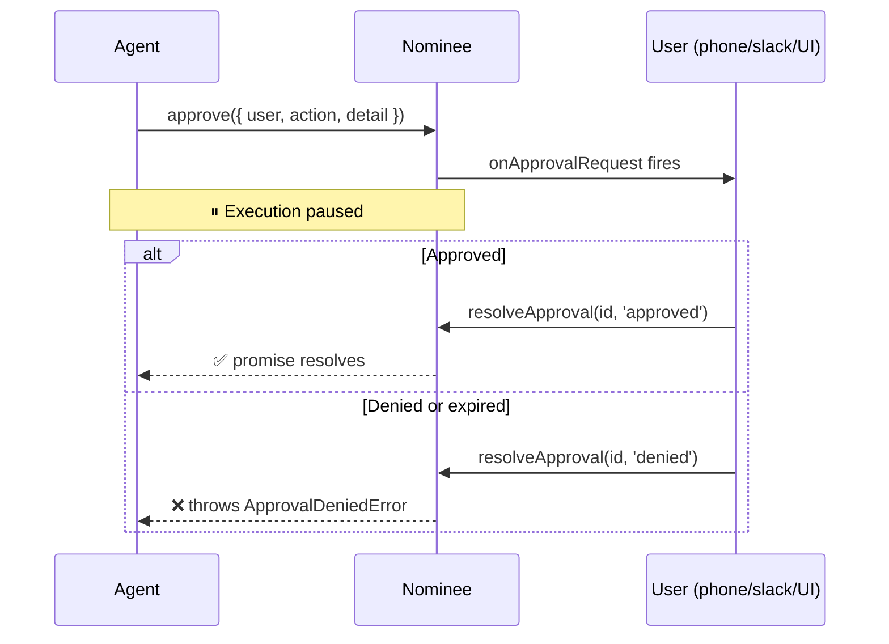

<p align="center">
  
</p>

<p align="center">
  <a href="https://www.npmjs.com/package/nominee"></a>
  <a href="https://github.com/bharath31/nominee/blob/main/LICENSE"></a>
</p>

<p align="center">
  <strong>Identity and token delegation for AI agents.</strong><br />
  Fresh third-party tokens at call time · Human-in-the-loop approval · Unified audit trail.
</p>

---

## Table of Contents

- [Installation](#installation)
- [The Problem](#the-problem)
- [Quickstart](#quickstart)
- [Strategies](#strategies)
- [Human-in-the-Loop Approvals](#human-in-the-loop-approvals)
- [Audit Log](#audit-log)
- [Full API](#full-api)
- [Adapters](#adapters)
- [Contributing](#contributing)

---

## Installation

```bash
npm i nominee
```

No signup. No SaaS account. No vendor lock-in.

---

## The Problem

Agents that act on behalf of users need **fresh** OAuth tokens at the moment of each tool call — not the token you captured at session start. Token expiry, long-running Durable Objects, and durable workflows all cause silent `401 Unauthorized` failures.

nominee caches tokens per `(user, connection)` and transparently refreshes them just before expiry. You call `nominee.token()` at call time. nominee handles everything else.

---

## How It Works



---

## Quickstart

```ts
import { Nominee, tokens } from 'nominee'

const nominee = new Nominee({
  // Pass any function that returns a token: DB, env var, literal
  strategy: tokens(async ({ user, connection }) =>
    db.getFreshToken(user, connection)
  ),

  // Optional: audit sink
  onAudit: (e) => logger.info(e),

  agent: 'triage-bot',
})

// Call at tool-call time — never cache the result yourself
const token = await nominee.token({ user: 'alice', connection: 'github' })
```

---

## Strategies

| Strategy | Description |
|---|---|
| `tokens(fn)` | Wraps any async function — env vars, your DB, a literal |
| `OAuth2({ connections })` | Generic refresh-token flow, zero runtime deps |
| `Memory({ tokens })` | In-memory store for dev and testing |
| [`nominee-auth0`](https://www.npmjs.com/package/nominee-auth0) | Auth0 Token Vault + CIBA (optional managed upgrade) |

```ts
import { tokens, OAuth2, Memory } from 'nominee'

// Function strategy (simplest)
tokens(({ connection }) => process.env[`${connection.toUpperCase()}_TOKEN`]!)

// OAuth2 refresh strategy
OAuth2({
  connections: {
    github: {
      tokenEndpoint: 'https://github.com/login/oauth/access_token',
      clientId: process.env.GITHUB_CLIENT_ID!,
      clientSecret: process.env.GITHUB_CLIENT_SECRET!,
      refreshToken: async ({ user }) => db.getRefreshToken(user, 'github'),
    },
  },
})

// In-memory (dev/test)
Memory({
  tokens: {
    alice: {
      github: { token: 'ghp_test', expiresAt: Date.now() + 3_600_000 },
    },
  },
})
```

---

## Human-in-the-Loop Approvals

Gate any agent action behind real-time human approval — independent of the LLM or framework.



```ts
import { Nominee, tokens, ApprovalDeniedError } from 'nominee'

const nominee = new Nominee({
  strategy: tokens(({ connection }) => getToken(connection)),

  onApprovalRequest: async ({ id, user, action, detail }) => {
    // Send a Slack message, push notification, or UI update
    await slack.send(user, { text: `Approve: ${action} — ${detail}`, id })
  },
})

try {
  // Blocks until the user responds
  await nominee.approve({
    user: 'alice',
    action: 'repo.delete',
    detail: 'Delete repository: alice/old-project',
  })
  // ✅ Continues here on approval
  await deleteRepo('alice/old-project')
} catch (e) {
  if (e instanceof ApprovalDeniedError) {
    console.log('User denied the action')
  }
}

// Settle from your webhook (Slack action, push notification callback, etc.)
nominee.resolveApproval(approvalId, 'approved')
```

---

## Audit Log

Every token fetch and approval decision is emitted as an audit event.

```ts
// Subscribe to the audit stream
const unsubscribe = nominee.on((event) => {
  // event.type: 'token.issued' | 'token.cached' | 'approval.requested' | 'approval.resolved'
  console.log(`[${event.type}] agent=${event.agent} user=${event.user}`)
  auditDb.insert(event)
})

// Or use the constructor shorthand
new Nominee({
  strategy: myStrategy,
  onAudit: (event) => auditDb.insert(event),
})
```

---

## Full API

```ts
// Fetch a fresh token (cached per user+connection, auto-refreshed before expiry)
await nominee.token({ user: string, connection: string })

// Gate on human approval. Throws ApprovalDeniedError if denied or expired.
await nominee.approve({ user: string, action: string, detail?: unknown })

// Settle an approval from your webhook
nominee.resolveApproval(id: string, decision: 'approved' | 'denied')

// Fine-grained authorization (requires strategy to implement can())
await nominee.can({ user: string, action: string, resource: string })

// Subscribe to audit events — returns an unsubscribe function
const unsub = nominee.on((event: AuditEvent) => void)
```

---

## Adapters

Use nominee inside your framework's tool system with zero boilerplate:

| Framework | Package |
|---|---|
| Vercel AI SDK | [`nominee-ai`](https://www.npmjs.com/package/nominee-ai) |
| Vercel Eve | [`nominee-eve`](https://www.npmjs.com/package/nominee-eve) |
| Cloudflare Agents | [`nominee-ai`](https://www.npmjs.com/package/nominee-ai) |
| Auth0 Token Vault + CIBA | [`nominee-auth0`](https://www.npmjs.com/package/nominee-auth0) |

---

## Contributing

Community strategies for Clerk, Supabase, WorkOS and others are very welcome. See [CONTRIBUTING.md](https://github.com/bharath31/nominee/blob/main/CONTRIBUTING.md) for the Strategy contract.

---

<p align="center">
  <a href="https://github.com/bharath31/nominee">GitHub</a> ·
  <a href="https://github.com/bharath31/nominee/blob/main/CONTRIBUTING.md">Contributing</a> ·
  MIT License
</p>
