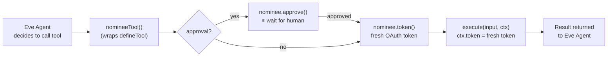

<p align="center">
  
</p>

<p align="center">
  <a href="https://www.npmjs.com/package/nominee-eve"></a>
  <a href="https://www.npmjs.com/package/nominee"></a>
  <a href="https://github.com/bharath31/nominee/blob/main/LICENSE"></a>
</p>

<p align="center">
  <strong>Vercel Eve adapter for nominee.</strong><br />
  Fresh tokens and human-in-the-loop approval — injected automatically into every Eve agent tool.
</p>

> **Note:** Eve is ESM-only, so `nominee-eve` is ESM-only too.

---

## Installation

```bash
npm i nominee nominee-eve
```

---

## How It Works



---

## Quickstart

```ts
// agent/tools/star_repo.ts
import { nomineeTool } from 'nominee-eve'
import { Nominee, tokens } from 'nominee'
import { z } from 'zod'

const nominee = new Nominee({
  strategy: tokens(({ connection }) =>
    process.env[`${connection.toUpperCase()}_TOKEN`]!
  ),
  onApprovalRequest: async (req) => notifyUser(req),
})

export const starRepo = nomineeTool({
  nominee,
  user: 'user_123',
  connection: 'github',                              // fresh token → ctx.token
  description: 'Star a GitHub repository on behalf of the user',
  inputSchema: z.object({
    repo: z.string().describe('owner/repo to star, e.g. vercel/ai'),
  }),
  execute: async ({ repo }, ctx) => {
    await fetch(`https://api.github.com/user/starred/${repo}`, {
      method: 'PUT',
      headers: { Authorization: `Bearer ${ctx.token}` },
    })
    return { starred: repo }
  },
})
```

Eve's `defineTool` is called internally — the output is fully branded and accepted by the Eve runtime.

---

## Human Approval

```ts
export const deleteFile = nomineeTool({
  nominee,
  user: 'user_123',
  connection: 'drive',
  approval: true,                   // ⏸ pauses until user approves
  action: 'drive.delete',
  description: 'Delete a file from Google Drive',
  inputSchema: z.object({ fileId: z.string() }),
  execute: async ({ fileId }, ctx) => {
    // Only runs after explicit human approval
    return await driveDelete(fileId, ctx.token)
  },
})
```

---

## `withNominee` — Shared Defaults

```ts
import { withNominee } from 'nominee-eve'

const nomineeTool = withNominee(nominee, {
  user: 'user_123',
})

export const tool1 = nomineeTool({ ... })
export const tool2 = nomineeTool({ ... })
```

---

## Tool Context

```ts
execute: async (input, ctx) => {
  ctx.token     // string — fresh OAuth token for the configured connection
  ctx.user      // string — the current user ID
  ctx.eve       // raw Eve tool context
}
```

---

## Eve Agent Structure

```
my-agent/
  agent/
    tools/
      star_repo.ts     ← nomineeTool() here
      delete_file.ts
  lib/
    nominee.ts         ← shared Nominee instance
```

---

<p align="center">
  <a href="https://github.com/bharath31/nominee">GitHub</a> ·
  <a href="https://www.npmjs.com/package/nominee">nominee core</a> ·
  MIT License
</p>
