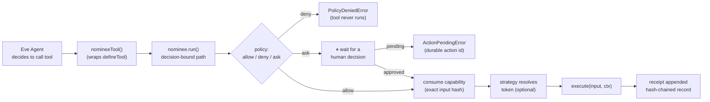

<p align="center">
  
</p>

<p align="center">
  <a href="https://www.npmjs.com/package/nominee-eve"></a>
  <a href="https://www.npmjs.com/package/nominee"></a>
  <a href="https://github.com/bharath31/nominee/blob/main/LICENSE"></a>
</p>

<p align="center">
  <strong>Vercel Eve adapter for nominee.</strong><br />
  Policy, portable approvals, and receipts on every Eve agent tool — plus a fresh token at call time.
</p>

> **Note:** Eve is ESM-only, so `nominee-eve` is ESM-only too.

---

## Installation

```bash
npm i nominee nominee-eve
```

> **Install Eve explicitly, pinned.** On npm, bare `npm i eve` still resolves to
> an unrelated 2013-era library (`eve@0.5.x`, "Simple custom events"). Vercel's
> Eve agent framework is `eve@0.27+`. npm installs this adapter's `eve` peer
> automatically, but pnpm does not — so the safe, explicit form is:
>
> ```bash
> npm i eve@^0.42.0        # or your preferred 0.27+ version
> ```
>
> If you see `Cannot find package 'eve/tools'` (or a peer warning about
> `eve@0.5.x`), Eve itself was not installed at a compatible version.

---

## Observe Before Enforcing

Pass `new Nominee({ mode: 'observe' })` into `nomineeTool` or `withNominee` to
inventory the Eve tool callbacks that actually run before writing a policy.
Nominee and Eve-native approval gates configured through this adapter are
suppressed while the policy verdicts are recorded. Observation reports do not
retain raw string/boolean values or user IDs; numeric aggregates may be
sensitive. Observe mode is not a security control and cannot be combined with
`production: true`.

---

## How It Works


```mermaid
flowchart LR
    Agent["Eve Agent\ndecides to call tool"] --> T["nomineeTool()\n(wraps defineTool)"]
    T --> RUN["nominee.run()\ndecision-bound path"]
    RUN --> P{"policy:\nallow / deny / ask"}
    P -->|deny| X["PolicyDeniedError\n(tool never runs)"]
    P -->|ask| AP["⏸ wait for a\nhuman decision"]
    AP -->|pending| APE["ActionPendingError\n(durable action id)"]
    AP -->|approved| CAP["consume capability\n(exact input hash)"]
    P -->|allow| CAP
    CAP --> TOK["strategy resolves\ntoken (optional)"]
    TOK --> EX["execute(input, ctx)"]
    EX --> R["receipt appended\nhash-chained record"]
```

`nomineeTool` routes every call through `nominee.run()` — binding authorization to a fingerprint of the arguments and issuing a single-use capability before `execute` runs. Denied calls throw `PolicyDeniedError`; `ask` calls block until a human decides or surface `ActionPendingError` when the approval outlives the request; every outcome (including refusals) lands on the receipt chain. The same policy and receipts travel with you if the agent moves off Eve.

---

## Quickstart

```ts
// agent/tools/star_repo.ts
import { nomineeTool } from 'nominee-eve'
import { Nominee, allow, ask, tokens } from 'nominee'
import { z } from 'zod'

const nominee = new Nominee({
  policy: {
    rules: [allow('github.star'), ask('github.delete_repo')],
    fallback: 'deny',
  },
  strategy: tokens(({ connection }) =>
    process.env[`${connection.toUpperCase()}_TOKEN`]!
  ),
  onApprovalRequest: async (req) => notifyUser(req),
})

export const starRepo = nomineeTool({
  nominee,
  user: 'user_123',
  connection: 'github',                              // fresh token → ctx.token
  action: 'github.star',                             // the name your policy matches on
  description: 'Star a GitHub repository on behalf of the user',
  inputSchema: z.object({
    repo: z.string().describe('owner/repo to star, e.g. vercel/ai'),
  }),
  execute: async ({ repo }, ctx) => {
    await fetch(`https://api.github.com/user/starred/${repo}`, {
      method: 'PUT',
      headers: { Authorization: `Bearer ${ctx.token}` },
    })
    return { starred: repo }
  },
})
```

Eve's `defineTool` is called internally — the output is fully branded and accepted by the Eve runtime.

---

## Approvals — Portable, Not Just Eve's

`ask` rules (and `approval: true`, which forces the ask even when the policy allows) route through nominee's approval engine — resolve them from Slack, push, a webhook, or a native strategy flow like Auth0 CIBA. Denials throw `ApprovalDeniedError` before the tool runs, and land on the receipt chain:

```ts
export const deleteFile = nomineeTool({
  nominee,
  user: 'user_123',
  connection: 'drive',
  approval: true,                   // ⏸ pauses until a human approves
  action: 'drive.delete',
  description: 'Delete a file from Google Drive',
  inputSchema: z.object({ fileId: z.string() }),
  execute: async ({ fileId }, ctx) => {
    // Only runs after explicit human approval
    return await driveDelete(fileId, ctx.token)
  },
})
```

Eve's own durable interactive consent still works alongside: pass
`eveApproval: always()` (or `once()`, `never()`, or a custom policy from
`eve/tools/approval`) and it is forwarded to Eve's `approval` field,
independent of nominee's portable gate. The older `needsApproval` adapter
option remains as a deprecated alias.

---

## What happens on `ask`

`ask` rules (and `approval: true`) route through `nominee.run()`. If a human settles the approval inline within the request, the tool runs right away. If the approval outlives the request, `execute` throws `ActionPendingError` with a durable `actionId` instead of hanging — the tool never runs. Catch it, persist the `actionId` **and the original input** (the durable action record stores only an input hash), then resume later with `resolveActionApproval()` → `resumeAction()` → `executeCapability()`. An Eve-native `eveApproval` gate is independent of this portable path and still applies on top of it. Full walkthrough: [Approvals that outlive the request](https://nominee.dev/docs/approvals/).

---

## `withNominee` — Shared Defaults

```ts
import { withNominee } from 'nominee-eve'

const nomineeTool = withNominee(nominee, {
  user: 'user_123',
})

export const tool1 = nomineeTool({ ... })
export const tool2 = nomineeTool({ ... })
```

---

## Tool Context

```ts
execute: async (input, ctx) => {
  ctx.token     // string — fresh token for the configured connection (if any)
  ctx.user      // string — the resolved principal
  ctx.eve       // raw Eve tool context (session, getToken, requireAuth, …)
}
```

`user` can be a fixed id or a function of the Eve context: `(ctx) => ctx.session.userId`.

---

## Eve Agent Structure

```
my-agent/
  agent/
    tools/
      star_repo.ts     ← nomineeTool() here
      delete_file.ts
  lib/
    nominee.ts         ← shared Nominee instance (policy + strategy)
```

---

<p align="center">
  <a href="https://github.com/bharath31/nominee">GitHub</a> ·
  <a href="https://www.npmjs.com/package/nominee">nominee core</a> ·
  MIT License
</p>
